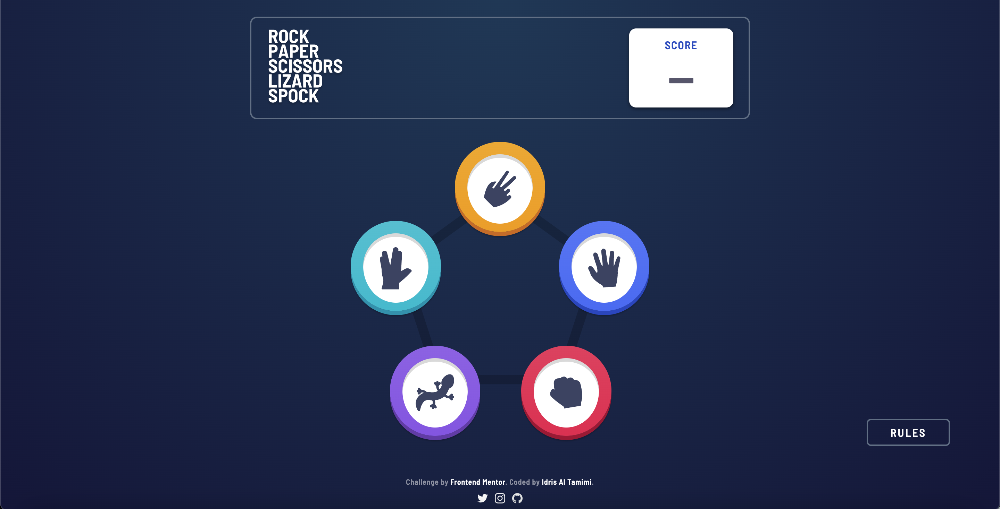
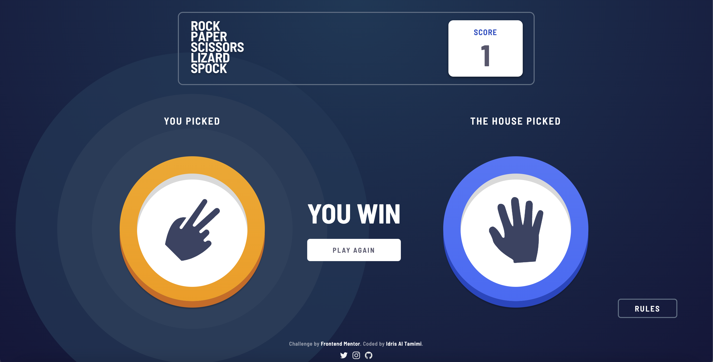
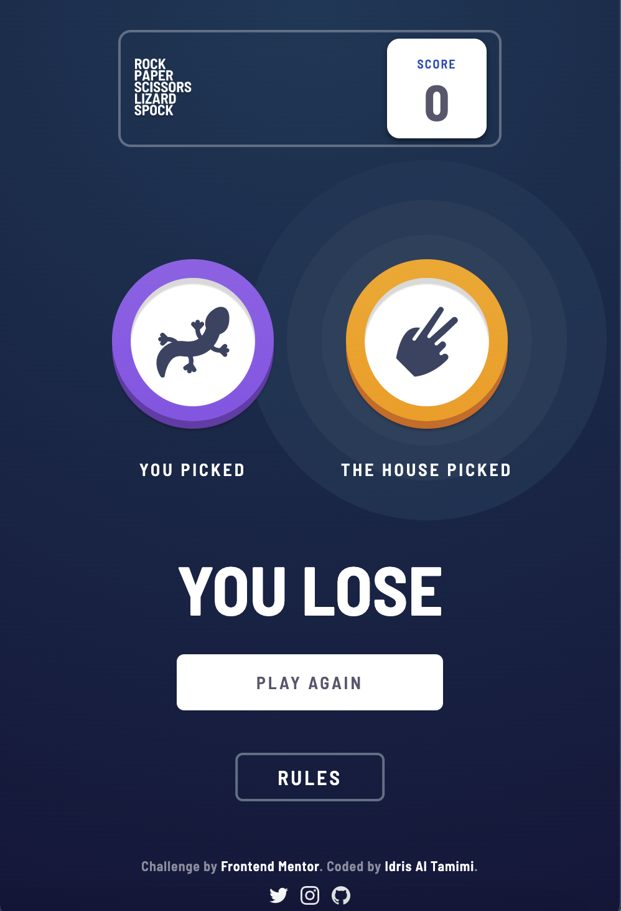
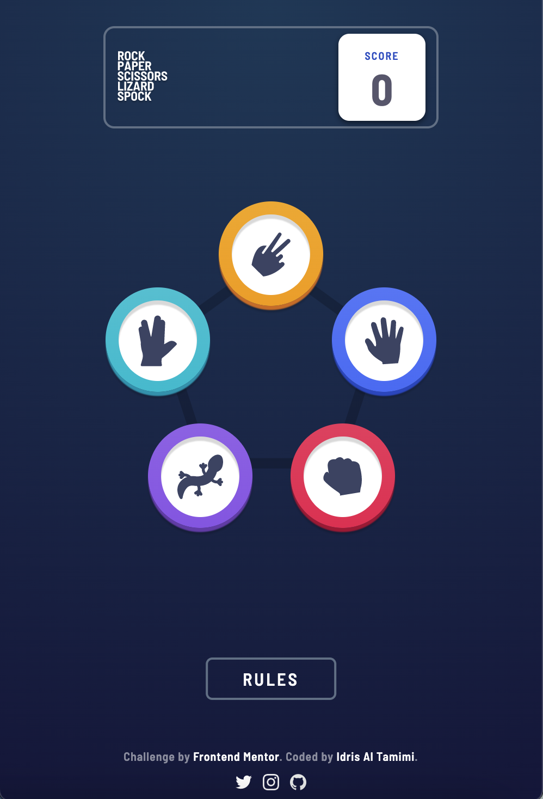

# Frontend Mentor - Rock, Paper, Scissors, Lizard, Spock solution

  

This is a solution to the [Rock, Paper, Scissors challenge on Frontend Mentor](https://www.frontendmentor.io/challenges/rock-paper-scissors-game-pTgwgvgH). Frontend Mentor challenges help you improve your coding skills by building realistic projects. 
  

## Table of contents

  

- [Overview](#overview)

- [The challenge](#the-challenge)

- [Screenshot](#screenshot)

- [Links](#links)

- [My process](#my-process)

- [Useful resources](#useful-resources)

- [Author](#author)

  

  

## Overview

  

### The challenge

  

Users should be able to:

- View the optimal layout for the game depending on their device's screen size
- Play Rock, Paper, Scissors against the computer
  

### Screenshot

  

  

### Links

  

- Solution URL: [GitHub Repository Link](https://github.com/idrisaltamimi/rochambeau-game.git)

- Live Site URL: [Live Site](https://idrisaltamimi.github.io/rochambeau-game/)

  

### Built with

  

- HTML5

- CSS

- JavaScript
  

## Author

  

- GitHub - [Idris Al Tamimi](https://github.com/idrisaltamimi)

  

- Frontend Mentor - [@idrisaltamimi](https://www.frontendmentor.io/profile/idrisaltamimi)

  

- Twitter - [@idris_altamimi](https://twitter.com/idris_altamimi)

- Instagram - [idris.altamimi](https://www.instagram.com/idris.altamimi/)
